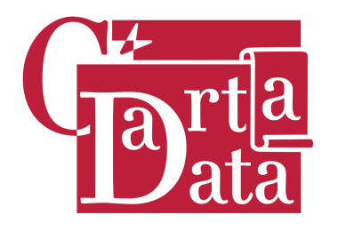
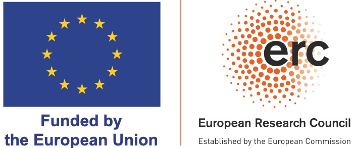
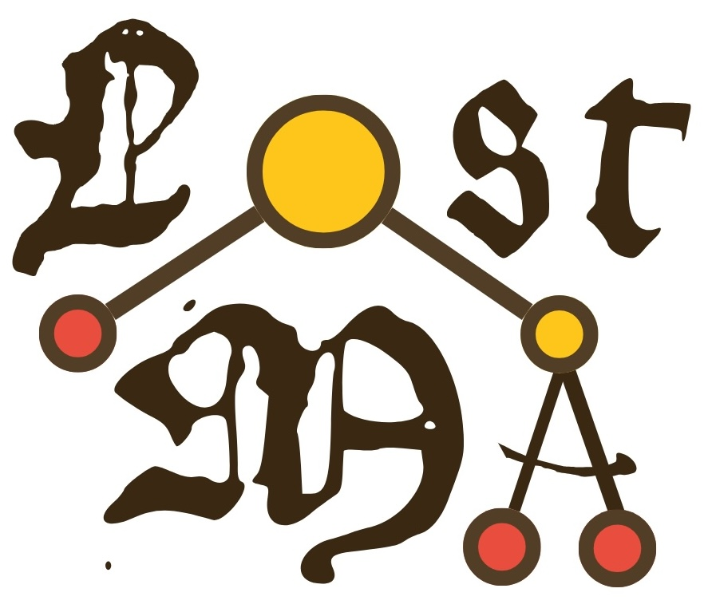

# Semaine de compétitions et de hackathons du master HN - 2026

Le master « Humanités numériques » est un master Recherche délivré par l'Université PSL. Il forme à l'exploitation et à l'analyse des données des sciences humaines, sociales et des disciplines des humanités. La formation s'adresse à des étudiants titulaires d'une licence qui souhaitent développer une double compétence thématique en humanités, dans la discipline de leur choix (histoire, philologie, lettres, sociologie, etc.), et en datascience.

**Contexte** : Le master HN a organisé, du 5 au 9 janvier 2026, une semaine de hackathons et compétitions en IA et sciences des données pour les SHS, à laquelle ont pris part l'ensemble des étudiants.
- L'appel à projets : https://www.chartes.psl.eu/gazette-chartiste/actualites/appel-propositions-pour-une-semaine-de-hackathons

## Projets

Détail des projets et institutions retenues : https://www.chartes.psl.eu/projets-pour-la-semaine-de-hackathons-pour-les-shs

### Projet 1 : Plonger au cœur des réseaux à la cour de France (XVIIe–XVIIIe siècles) - 
Centre de recherche du Château de Versailles
- Équipe : Julie Duhesme (M2),	Juliette Grenier (M2), Come Parrinello (M2),	Martin Houllier (M2),	Philippe Chaumet-Riffaud (M2)
- Résultats :

### Projet 2 : Entités nommées dans la BiblioBase
 - CNRS, ANR, cellf
- Équipe : Gaëtan Drouet (M2), Radjaa Benabdallah (M2)
- Résultats :

### Projet 3 : Abbreviations and algorithms - The Icelandic challenge - 
École nationale des chartes-PSL, ANR
- Équipe : Pôle HTR collectif (dir. Chahan Vidal-Gorène, Alexandre Lionnet-Rollin)
- Résultats :

### Projet 4 : Album de Vaucluse : Quand les cartes postales révèlent le territoire - 
Archives départementales du Vaucluse
- Équipe : Maxime Letoffe (M1), Mathieu Riviere (M1),	Mathias Garnier (M1)
- Résultats : https://github.com/icimathieu/vaucluse

### Projet 5 : Explorer les voies de classement et de description des photographies du fonds Thierry - 
Institut National de l’Histoire de l’Art
- Équipe : Denise Atzori (M2), Thais Raffray (M1), Chiara Tedesco (M1)
- Résultats : https://github.com/DeniseAtzori/ThierryNum-ENC

### Projet 6 : Naturalis historia : Cartographier l’imaginaire naturel médiéval dans Mandragore - 
École nationale des chartes-PSL, BnF
- Équipe : Ye Liu (M2),	Nana Maglakelidze (M2)
- Résultats :

### Projet 7 : L’avortement à la télévision française (1960–2024) - 
Institut Nationale de l’Audiovisuel
- Équipe : Chloe Jollivet-Courtois (M2), Irandokht Moinzadeh (M1), Charles Planque (M1)
- Résultats :

### Projet 8 : Trouver les arbres cachés... - 
École nationale des chartes-PSL, ERC LostMa
- Équipe : Marie Bizais (M2), Ombeline Ferraris (M1), Eglantine Gaglione (M2), Mathias Garnier (M1)
- Résultats :

### Projet 9 : Des corpus en relief : identification, analyse et sérialisation de corpus épigraphiques - 
École nationale des chartes-PSL, ANR Ecclesia, CJM, CPAF
- Équipe : Marie Bizais (M2), Chahan Vidal-Gorène
- Résultats :

### Projet 10 : O.D.I.L : Indexer automatiquement les images du Moyen-Âge par l’IA - 
École nationale des chartes-PSL, EHESS, Biblissima, EPFL
- Équipe : Quanwen Long (M2), Tianjie Yin (M2)
- Résultats : https://github.com/LONG-QW/odil-vlm-finetuning-timel

### Projet 11 : Réunion de microfaciès de silicites par la reconnaissance de formes dans des images microscopiques - 
GDR Silex
- Équipe : Gaëtan Drouet (M2),	Mathias Garnier (M1)
- Résultats :

### Projet 12 : One prompt to rule them all? Compet. d’HTR de manuscrits médiévaux français
 - École nationale des chartes-PSL, ERC LostMa
- Équipe : Pôle HTR collectif (dir. Chahan Vidal-Gorène, Alexandre Lionnet-Rollin)
- Résultats :

### Projet 13 : Quand Archelec rencontre l'IA - 
SciencesPo
- Équipe : Maria Kirbasova (M2), Charles Planque (M1), Manon Remot (M1)
- Résultats :

### Projet 14 : Text Acquisition Pipeline for Early-Modern Latin Manuscripts - 
École nationale des chartes-PSL, ANR
- Équipe : Pôle HTR collectif (dir. Chahan Vidal-Gorène, Alexandre Lionnet-Rollin)
- Résultats :

### Projet 15 : Analyser en direct les flux de chaînes d’information en continu - 
InfoVox Tracker
- Équipe : Marisol Du Cauze De Nazelle (M1), Damien Conceicao (M2), Maria Kirbasova (M2), Garance Raynaud (M1), Manon Remot (M1)
- Résultats :

## Organisation

Organisé par : Chahan Vidal-Gorène

Avec le soutien de l'ERC LostMa, la junior-entreprise CartaData, l'ANR, la chaire de professeur junior de l'École nationale des chartes-PSL, le département de la recherche, la direction des études et les services logistiques.

     

